# GCP Web Security Scanner: XSS Lab

This lab deploys an intentionally vulnerable web application on Compute Engine, demonstrates reflected cross-site scripting (XSS), detects it with Web Security Scanner, and applies a code-level remediation.

## Workflow

1. Create a disposable GCP project and VM.
2. Deploy the application over SSH.
3. Test the XSS payload only against the lab VM.
4. Enable the Web Security Scanner API and create a scan configuration.
5. Apply context-aware output encoding and scan again to verify the finding is resolved.

## Evidence

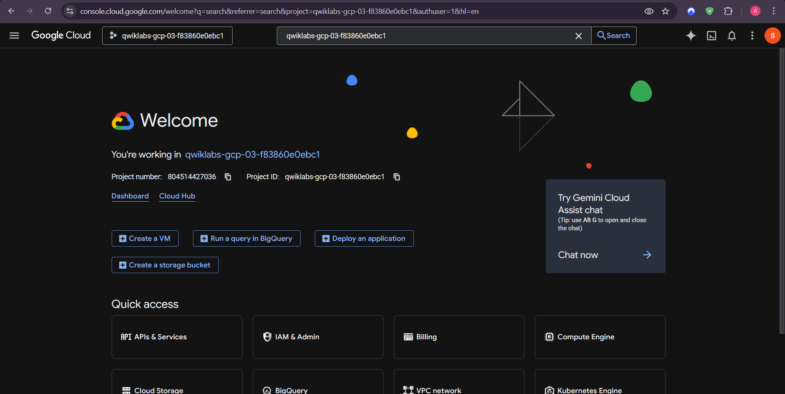
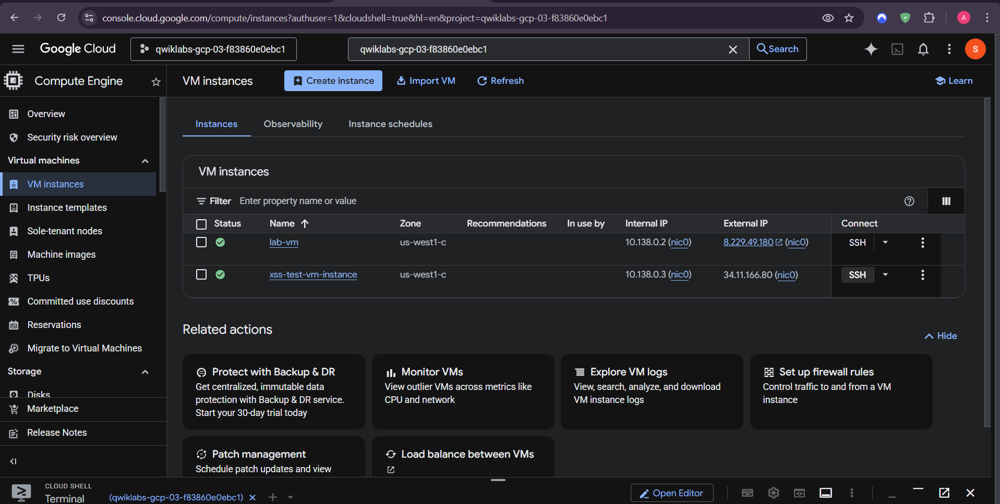
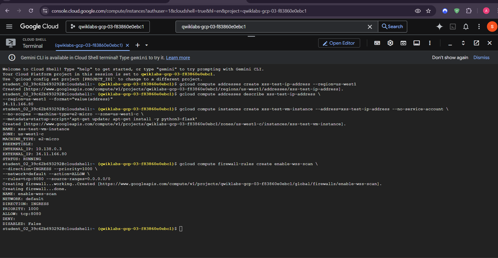
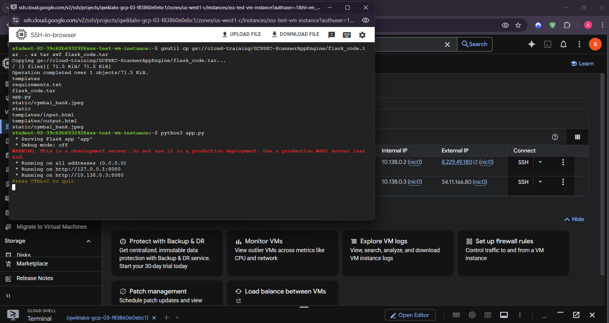
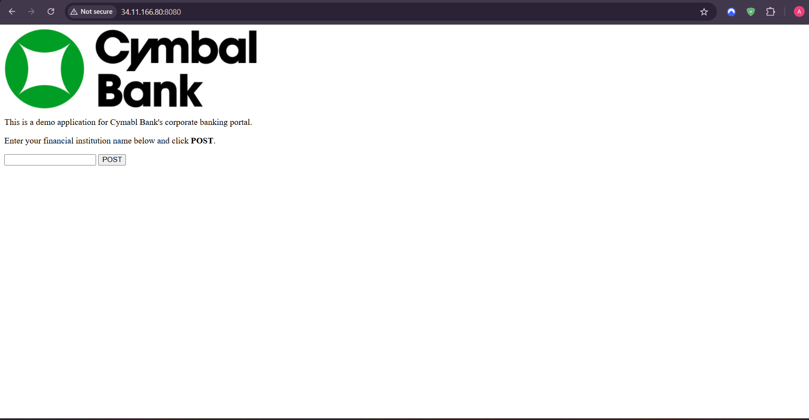
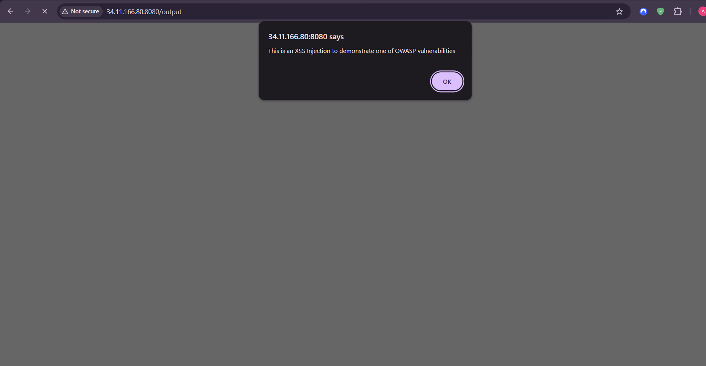
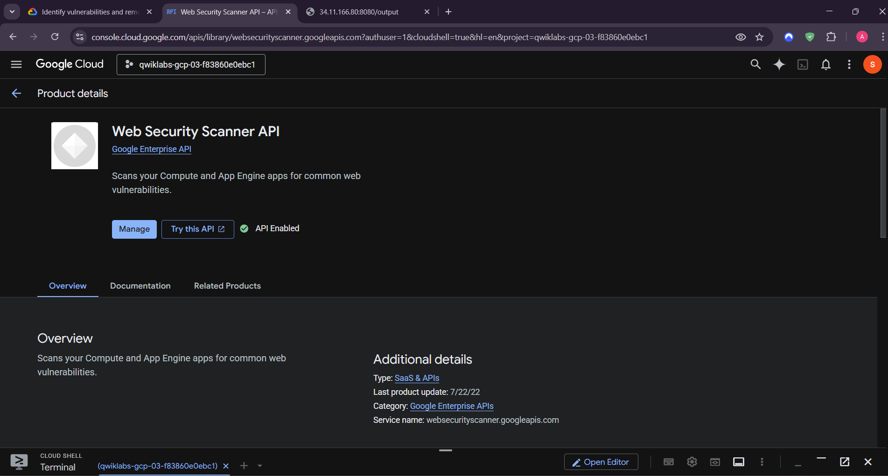
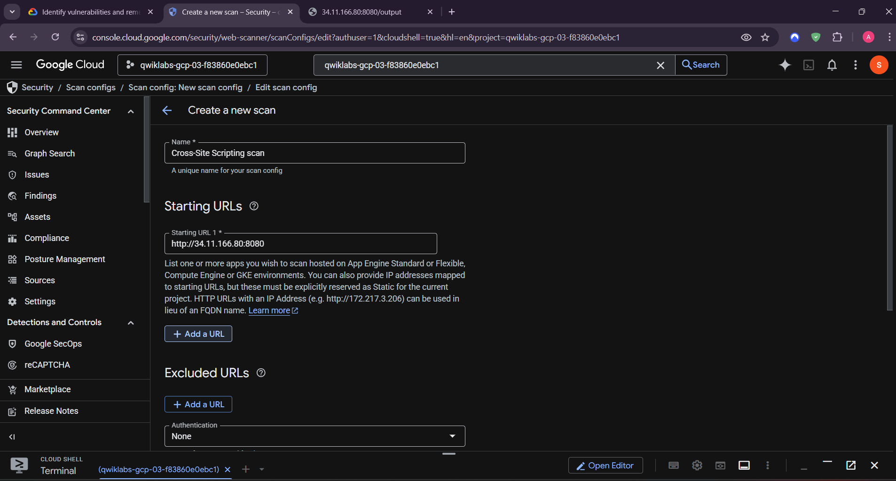
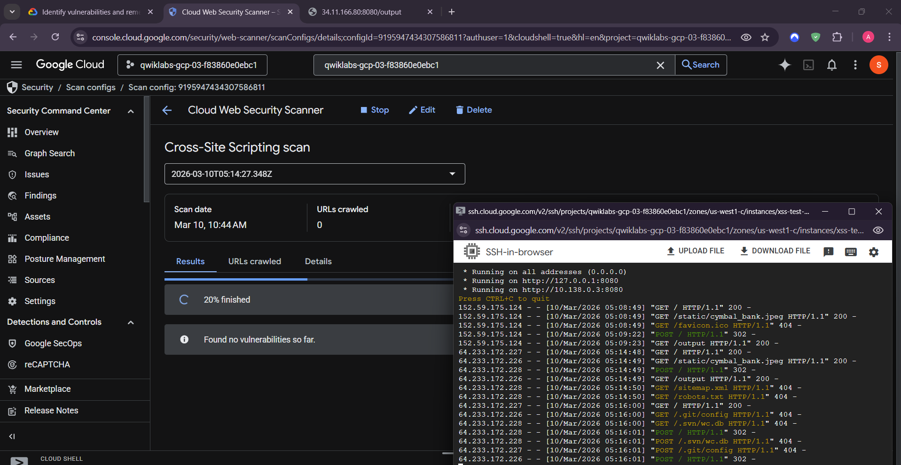
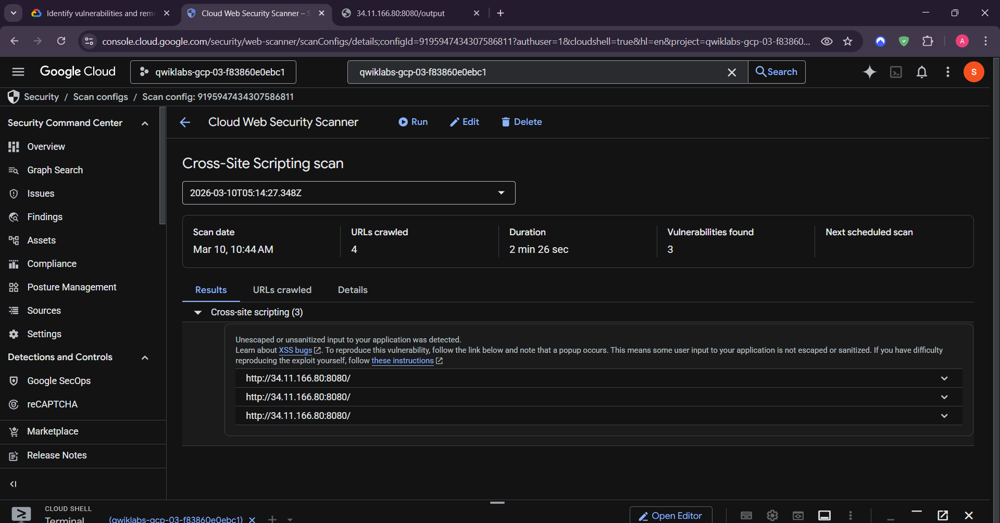
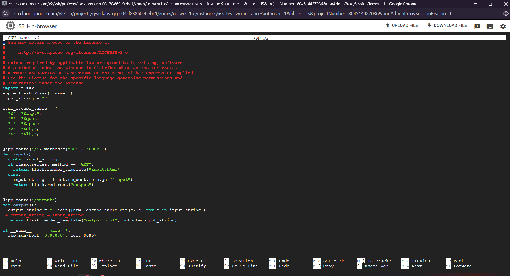

## Learning outcomes

- Deployed and managed a Compute Engine workload.
- Used a native GCP vulnerability scanner.
- Distinguished an intentionally vulnerable application from its remediated version.
- Applied output encoding appropriate to the rendering context.

**Author:** Kartikeya Uniyal
