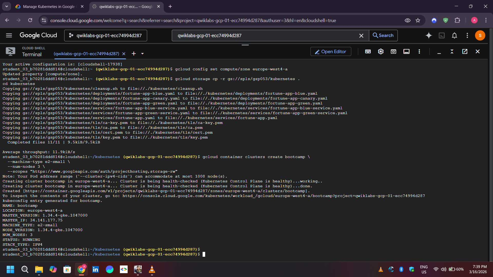
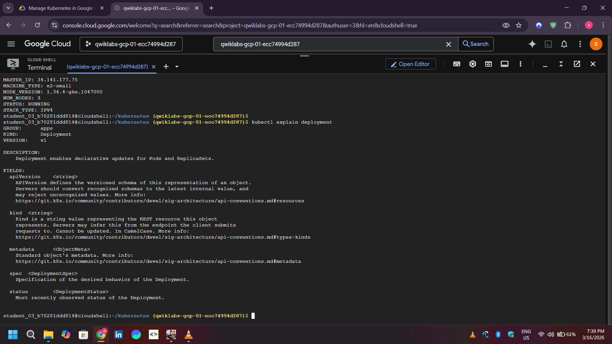
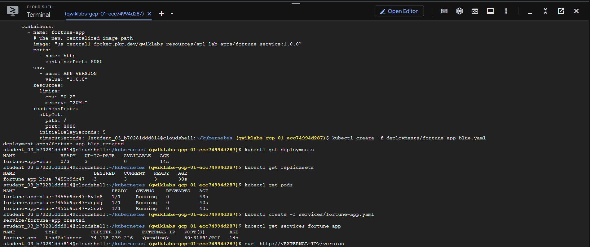
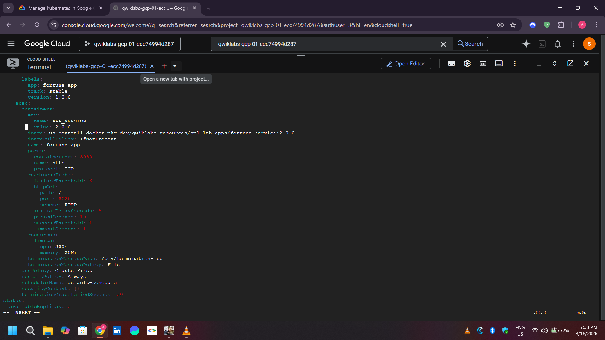
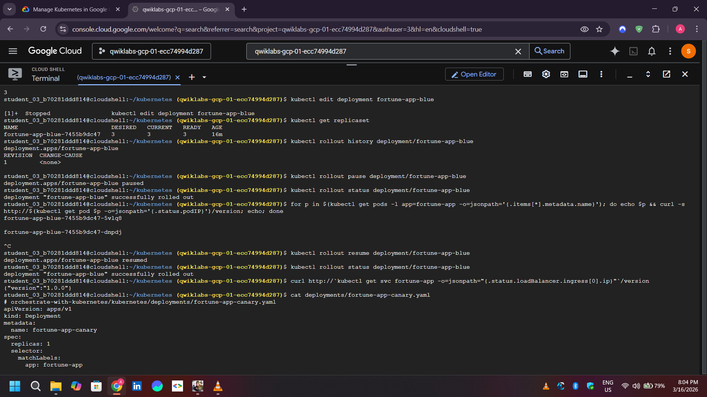
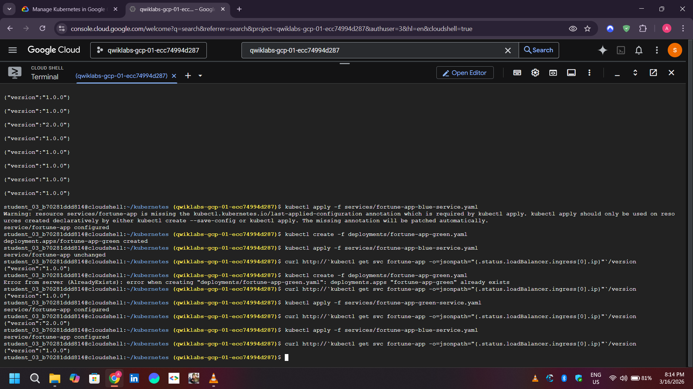

# GKE Deployment Strategies

This lab practices rolling, canary, and blue-green deployment patterns on Google Kubernetes Engine.

## Environment

The documented exercise used a three-node `bootcamp` cluster in `europe-west4-a`:

```bash
gcloud container clusters create bootcamp --num-nodes=3 --zone=europe-west4-a
gcloud container clusters get-credentials bootcamp --zone=europe-west4-a
```

## Workflow

```bash
kubectl create -f deployments/fortune-app-blue.yaml
kubectl create -f services/fortune-app.yaml
kubectl rollout status deployment/fortune-app-blue
kubectl explain deployment --recursive
```

The exercise updates the image from v1 to v2, deploys a canary alongside the main deployment, and switches a Service selector between blue and green labels. A canary is only a controlled traffic fraction when replica ratios or an explicit traffic-management mechanism are configured; verify the actual distribution rather than assuming it.








## Cleanup

```bash
kubectl delete -f services/fortune-app.yaml
kubectl delete -f deployments/fortune-app-blue.yaml
gcloud container clusters delete bootcamp --zone=europe-west4-a
```

**Author:** Kartikeya Uniyal
