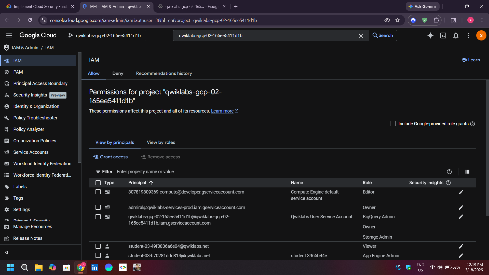
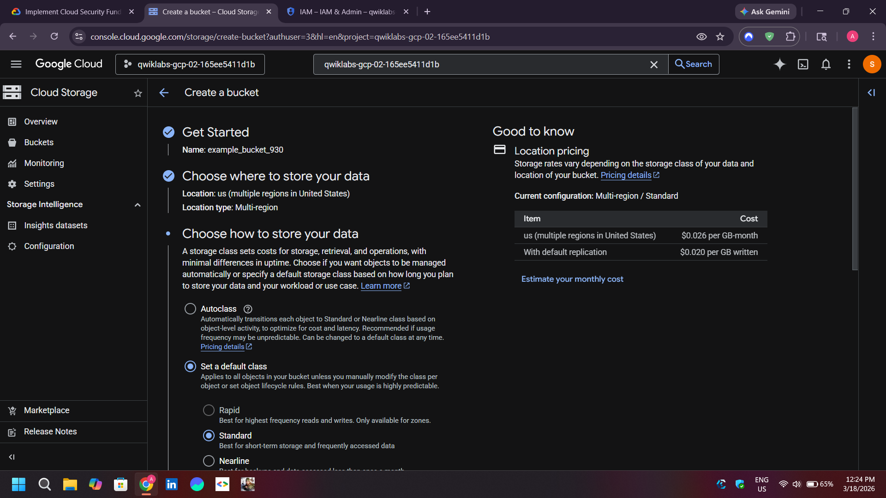
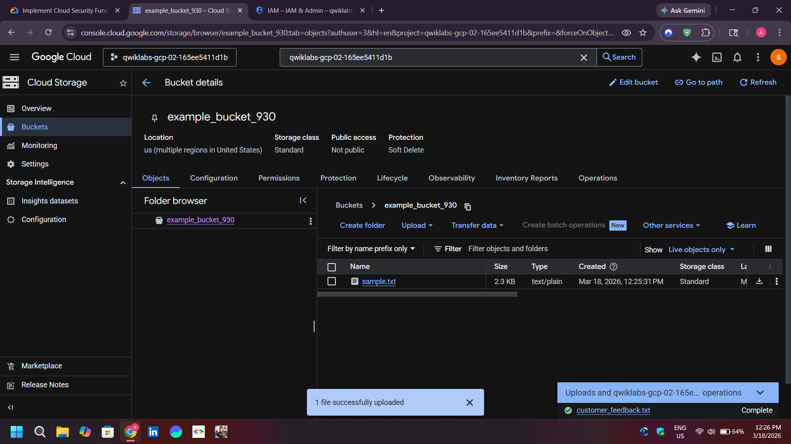
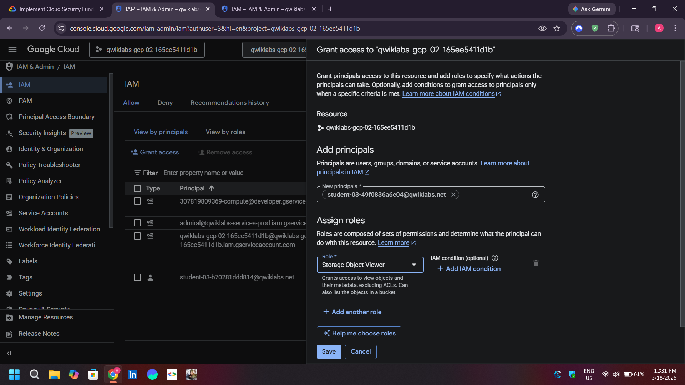

# Google Cloud IAM Access Management

This lab compares broad project roles with a bucket-scoped predefined role and verifies access using two authorized test identities.

## Scenario

- Identity 1: project owner for the exercise. Project IAM and billing-account permissions are separate; Owner does not automatically grant billing-account administration.
- Identity 2: initially a project Viewer, then removed from the project and granted `roles/storage.objectViewer` at the test bucket level.

## Workflow

1. Create a unique bucket and upload `sample.txt`.
2. Verify the Viewer can inspect the intended resources.
3. Remove the project Viewer binding and verify access is denied.
4. Grant `roles/storage.objectViewer` on the bucket, not the whole project.
5. Verify that the identity can read objects in that bucket without project-wide access.

The exercise demonstrates least privilege, but production access should normally use groups, workforce identities, and IAM Conditions rather than individual ad hoc bindings.

**Author:** Kartikeya Uniyal
