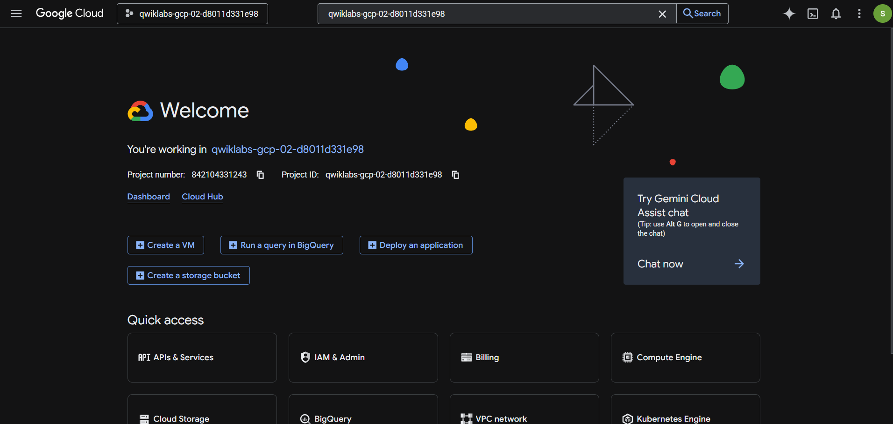
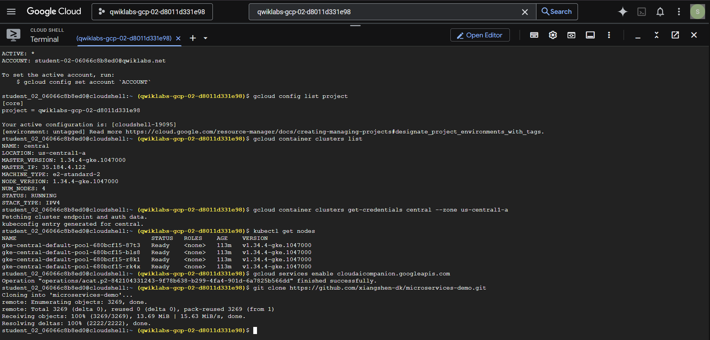
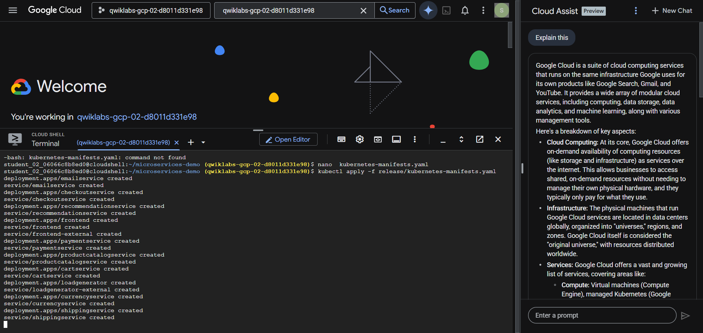
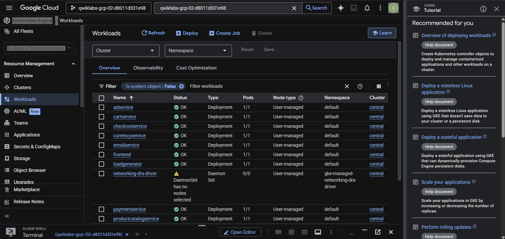
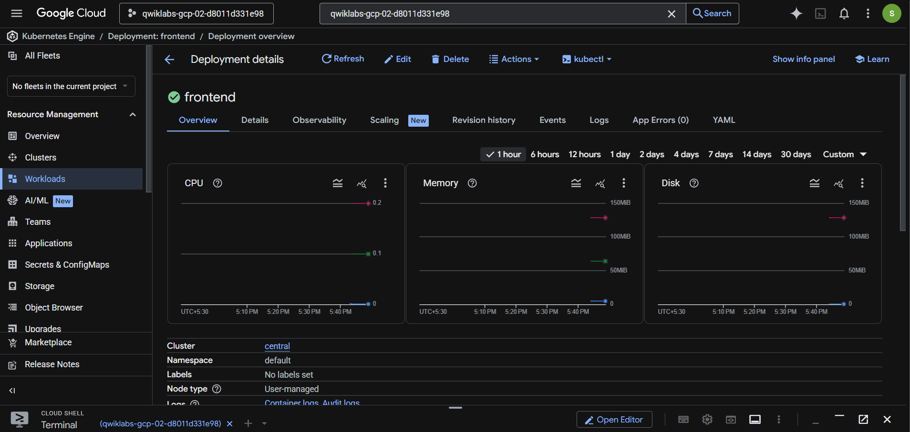
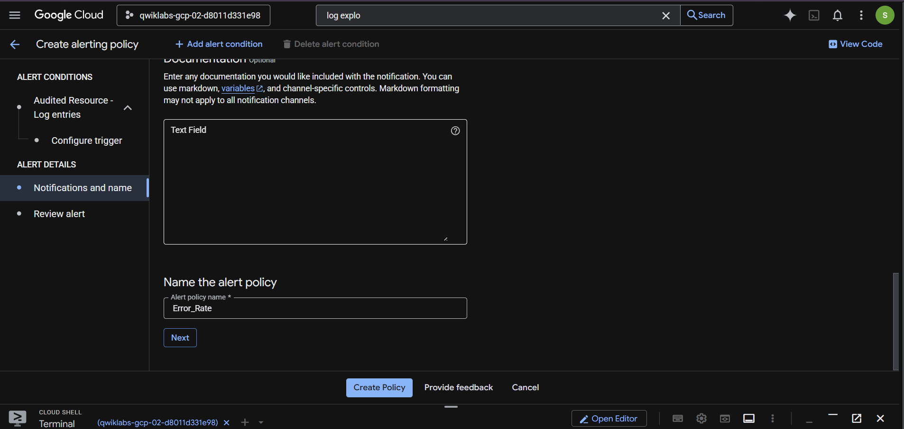
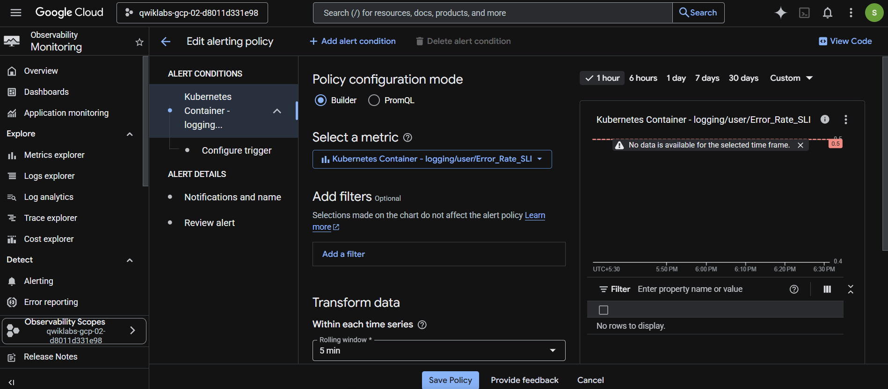

# Debug Applications on GKE

This lab deploys a microservices workload to GKE and uses Cloud Logging, Cloud Monitoring, log-based metrics, and alerting to investigate application behavior.

## Commands

```bash
gcloud config set project PROJECT_ID
kubectl apply -f kubernetes-manifests.yaml
kubectl get nodes
kubectl get deployments,services,pods
```

Create an `Error_Rate` alert from the relevant log-based metric, then validate it with controlled test traffic. The original evidence covers the dashboard, cluster, nodes, workloads, service, alert, and metrics.










## Cleanup

```bash
kubectl delete -f kubernetes-manifests.yaml
gcloud container clusters delete central --zone=us-central1-a
```

**Author:** Kartikeya Uniyal
