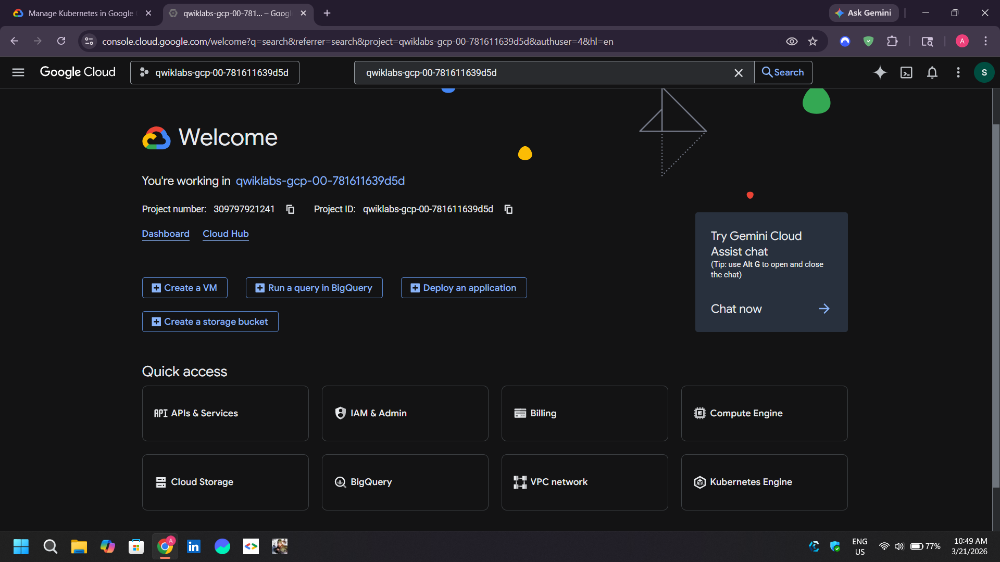
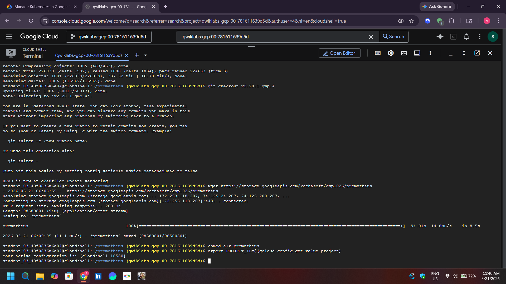
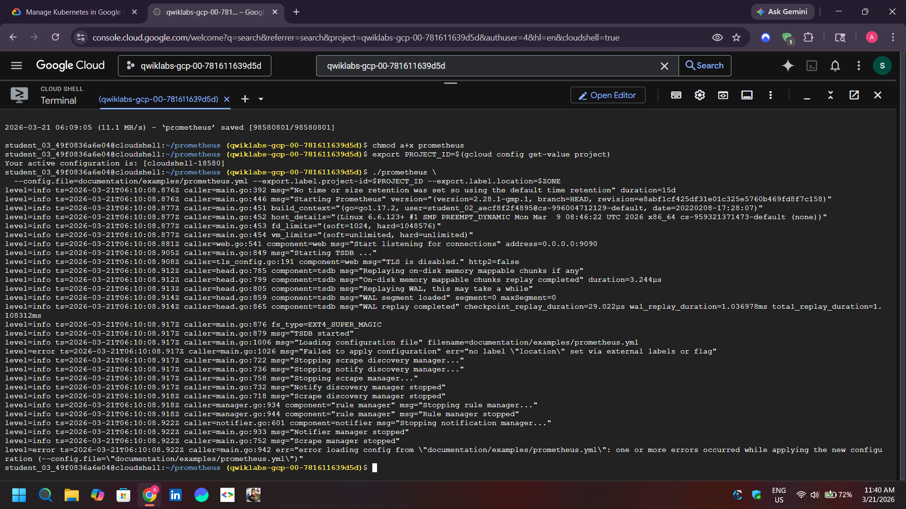
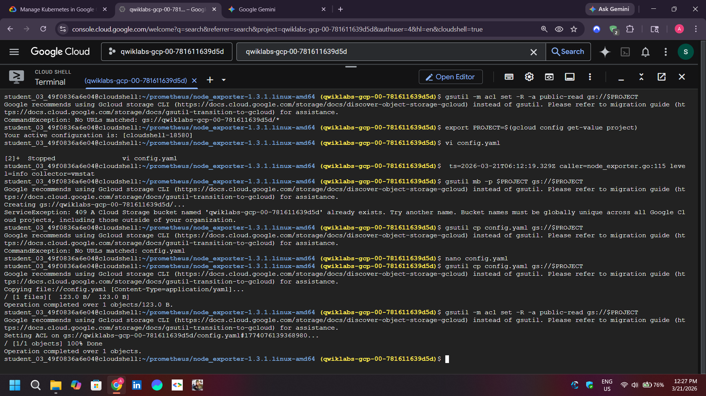

# Managed Service for Prometheus on GKE

This lab collects node-level metrics from GKE using an exporter and Google Cloud Managed Service for Prometheus (GMP).

## Workflow

1. Create a disposable GKE cluster with managed collection enabled.
2. Apply the exporter and `PodMonitoring` resource in `gke_labs.yaml`.
3. Confirm that the monitoring operator discovers the target.
4. Query the resulting Prometheus metrics in Cloud Monitoring.

```bash
gcloud container clusters get-credentials CLUSTER_NAME --zone=ZONE
kubectl apply -f gke_labs.yaml
kubectl get pods
kubectl get podmonitoring --all-namespaces
kubectl describe podmonitoring --all-namespaces
```






Common failure points are a selector that does not match exporter labels, missing GMP APIs or permissions, and a scrape endpoint that is not reachable. Check events and the target status before troubleshooting queries.

## Cleanup

```bash
kubectl delete -f gke_labs.yaml
gcloud container clusters delete CLUSTER_NAME --zone=ZONE
```

**Author:** Kartikeya Uniyal
