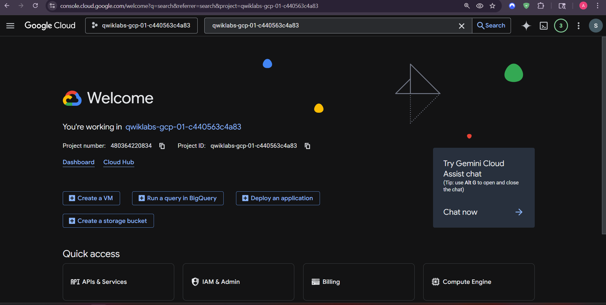
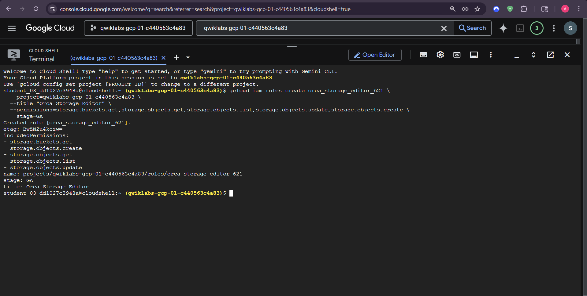
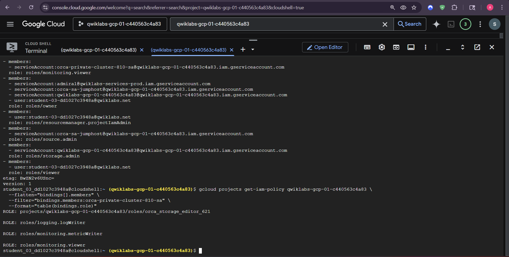
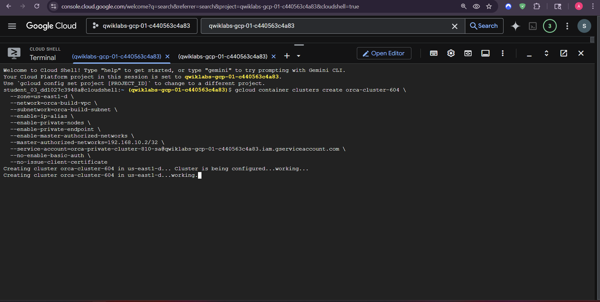
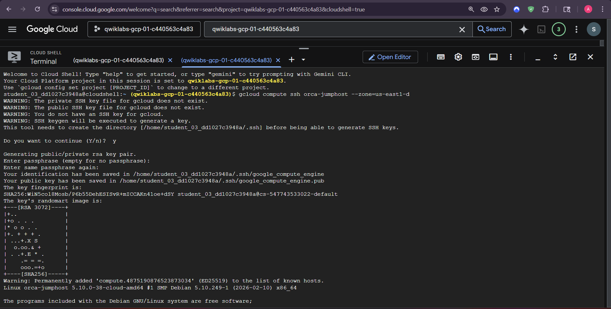
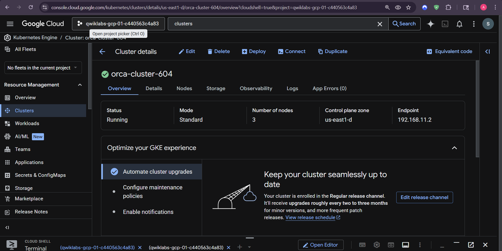
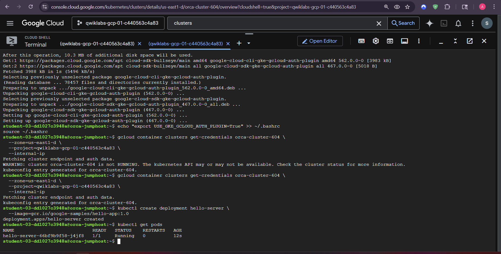

# Private GKE Security Fundamentals

This lab explores custom IAM, a dedicated service account, a private GKE cluster, and controlled access through a jump host.

## Security notes

- Use a custom role only for the exact permissions required by the workload.
- Bind `roles/monitoring.viewer` only where it is needed.
- `--enable-private-endpoint` removes the public control-plane endpoint; the jump host must reach the private endpoint through the VPC.
- Master Authorized Networks are distinct from a private endpoint. If used, document the actual `--enable-master-authorized-networks` and `--master-ipv4-cidr` or authorized CIDR configuration.
- A cluster service account must be explicitly supplied with `--service-account=SA_EMAIL`; creating an account alone does not make GKE use it.

## Example commands

```bash
gcloud iam roles create orca_storage_editor_621 \
  --project=PROJECT_ID \
  --permissions=storage.buckets.get,storage.objects.get,storage.objects.list,storage.objects.update,storage.objects.create \
  --stage=GA
gcloud iam service-accounts create orca-private-cluster-810-sa
gcloud projects add-iam-policy-binding PROJECT_ID \
  --member="serviceAccount:SA_EMAIL" --role="roles/monitoring.viewer"
gcloud container clusters create orca-cluster-604 \
  --zone=us-east1-d --network=orca-build-vpc --subnetwork=orca-build-subnet \
  --enable-private-nodes --enable-private-endpoint --service-account=SA_EMAIL
kubectl create deployment hello-server --image=gcr.io/google-samples/hello-app:1.0
```









**Author:** Kartikeya Uniyal
