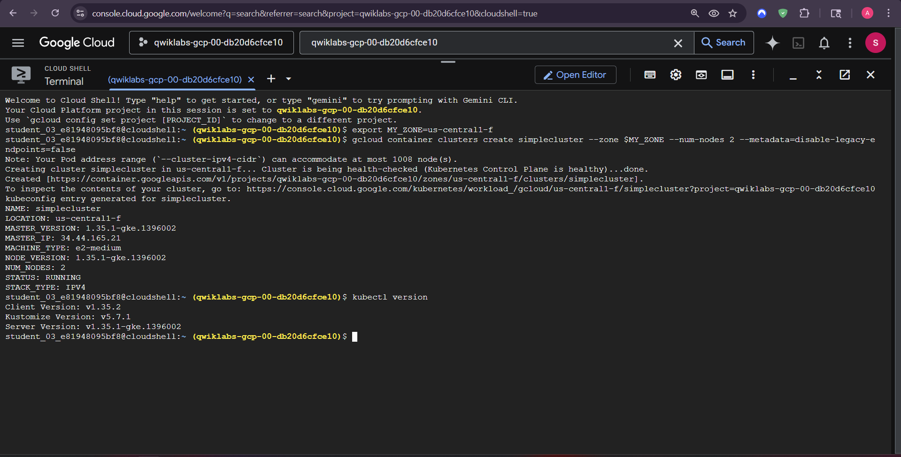
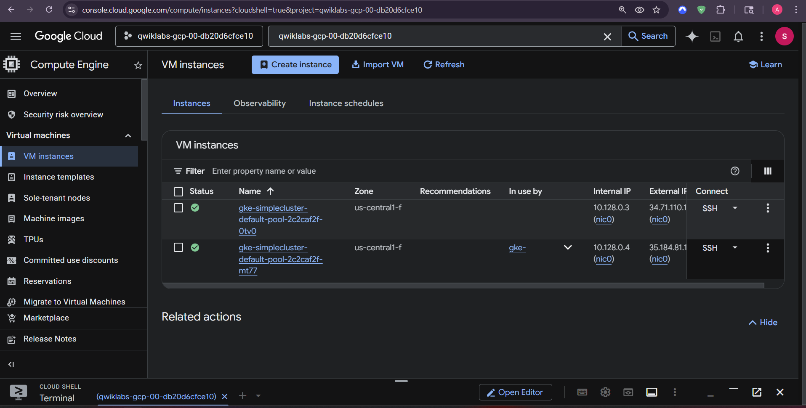
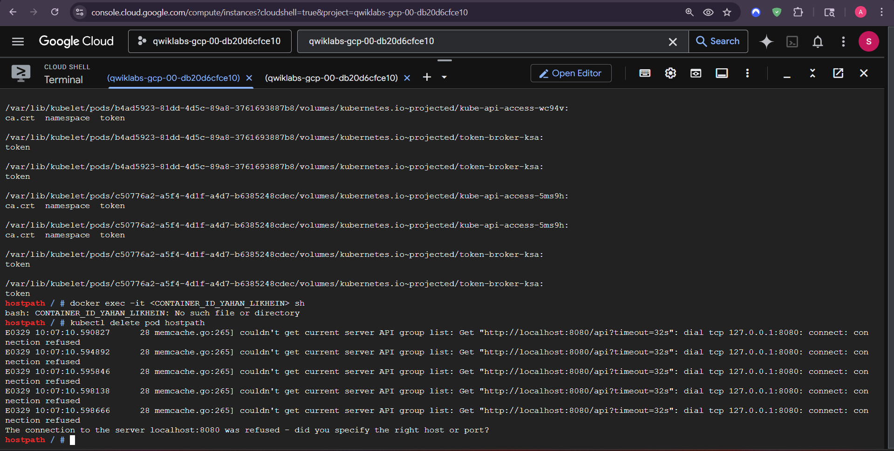
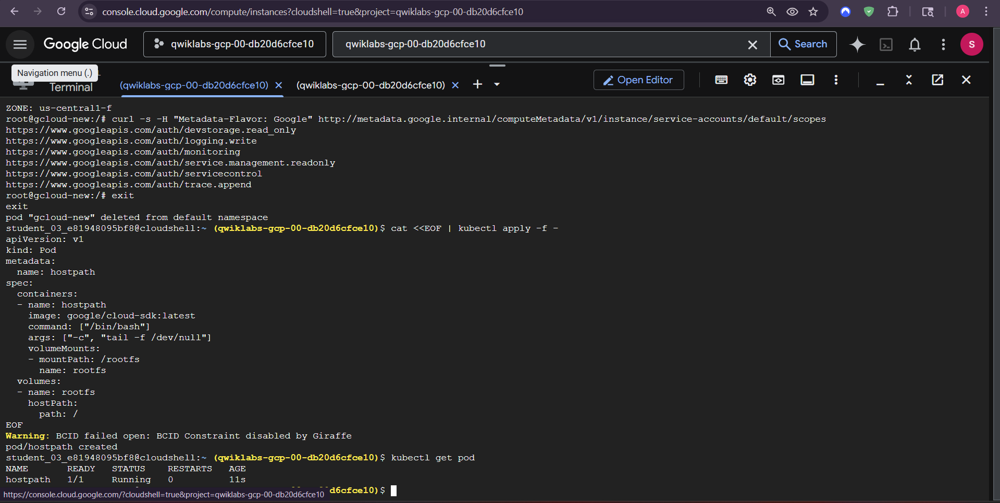
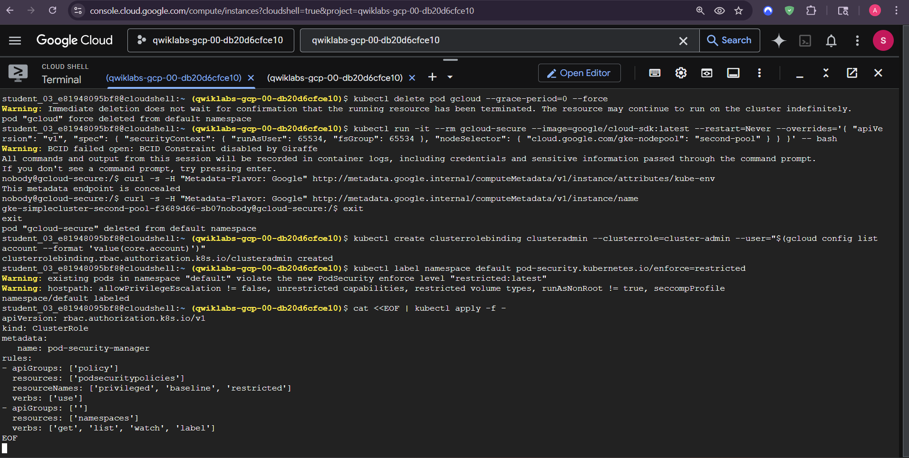
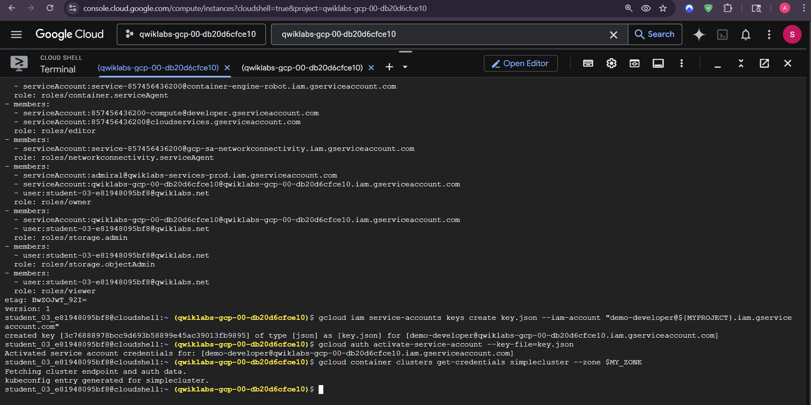

# Hardening GKE Workloads

This lab contrasts intentionally insecure workload configurations with safer Kubernetes settings. `hostPath` and metadata access are workload risks, not unavoidable default GKE behavior.

## Controls demonstrated

- Remove unnecessary `hostPath` mounts.
- Use a dedicated, least-privileged Kubernetes service account and RBAC binding.
- Use a restricted container security context.
- Limit access to the metadata server where supported by the node and workload configuration.
- Use Pod Security Standards through Pod Security Admission; the removed `PodSecurityPolicy` API is not used.

```bash
kubectl apply -f manifests/insecure-pod.yaml
kubectl apply -f manifests/secure-pod.yaml
kubectl apply -f manifests/rbac-config.yaml
kubectl get pods
kubectl auth can-i --list --as=system:serviceaccount:default:restricted-workload
```








**Author:** Kartikeya Uniyal
