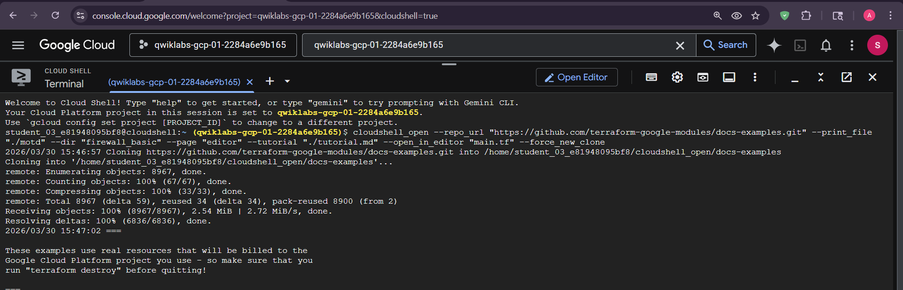
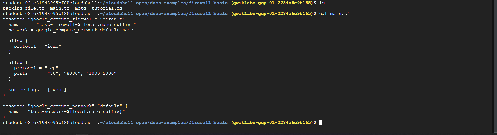
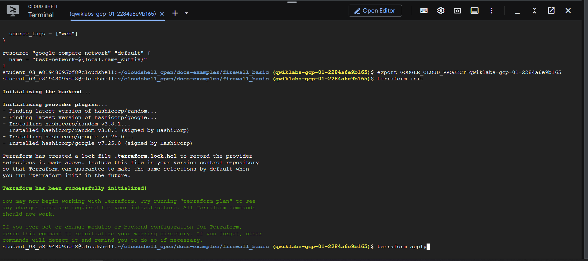
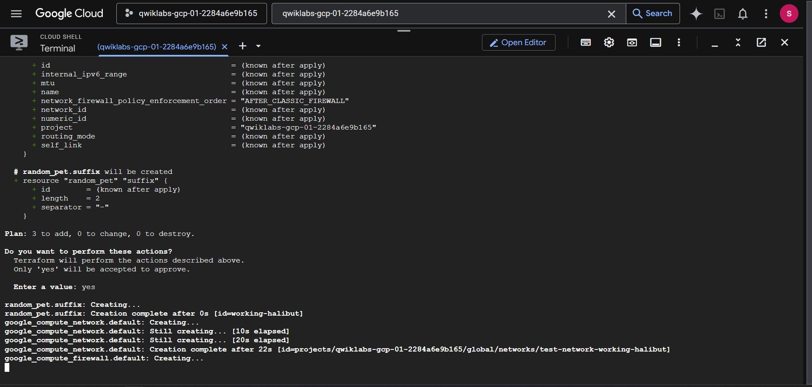
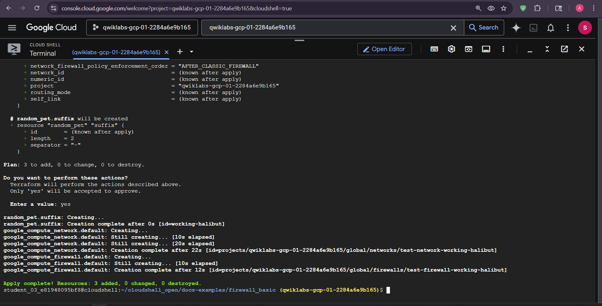

# Terraform VPC and Firewall Lab

This lab uses Terraform to create a custom VPC, a subnet, and firewall rules allowing ICMP, HTTP on port 80, TCP port 8080, and TCP ports 1000-2000. The example ingress rule uses `0.0.0.0/0` for a disposable learning environment; do not copy that source range into production without a specific requirement.

## Files

```text
README.md
main.tf
deploy.sh
terraform_deploy.py
lab_screenshot/
```

## Deploy

You can run Terraform directly:

```bash
export GOOGLE_CLOUD_PROJECT=your-project-id
gcloud config set project "$GOOGLE_CLOUD_PROJECT"
terraform init
terraform fmt -check
terraform validate
terraform plan
terraform apply
```

Or use one of the helper scripts:

```bash
./deploy.sh
python3 terraform_deploy.py
```

Both helpers validate and show the Terraform plan before applying it. They require interactive confirmation by default. Use `--auto-approve` only when non-interactive execution is intentional.

Review every plan before applying it. Terraform state can contain resource details; local state files are ignored and must not be committed.







## Cleanup

```bash
terraform destroy
```

**Author:** Kartikeya Uniyal
