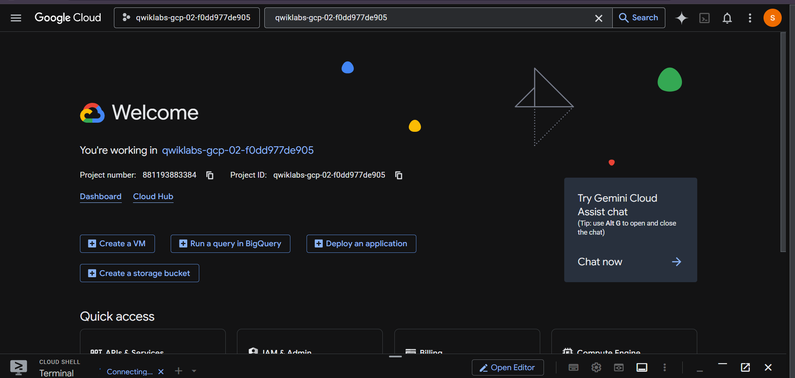
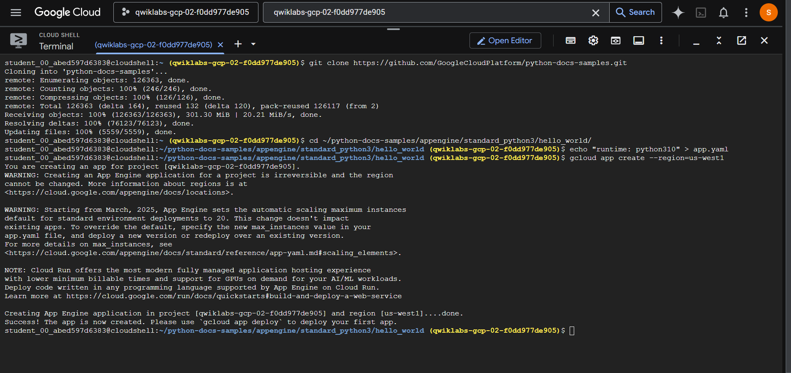
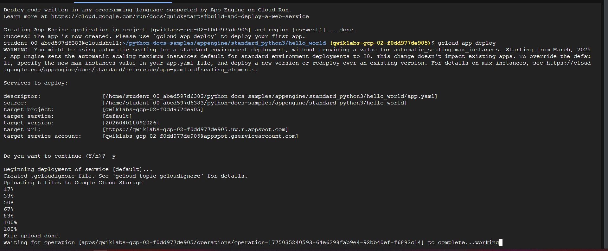
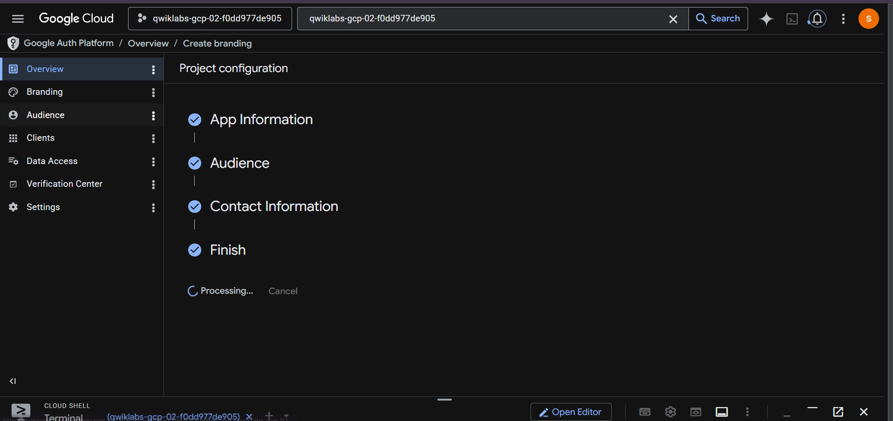
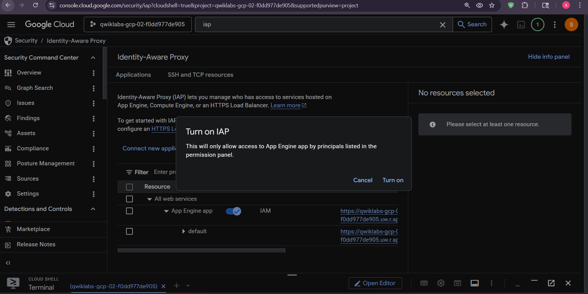
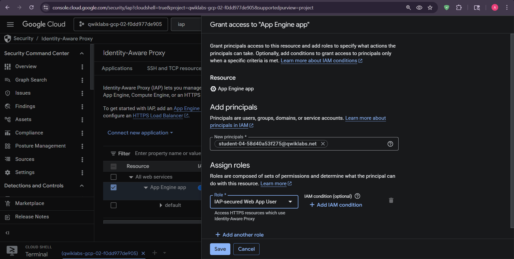

# App Engine with Identity-Aware Proxy

This lab deploys a Flask application to App Engine and protects it with Identity-Aware Proxy (IAP). IAP authenticates users before forwarding requests; it does not replace application authorization.

## Deploy

Run from this lab directory, where `app.yaml`, `Python_app.py`, and `deploy.sh` are stored:

```bash
gcloud config set project PROJECT_ID
gcloud app deploy app.yaml
```

Configure the OAuth consent screen, enable IAP for the App Engine backend, and grant authorized identities `roles/iap.httpsResourceAccessor` (shown in the console as IAP-secured Web App User). Verify both an authorized and unauthorized request.








## Cleanup

```bash
gcloud app versions list
gcloud app services set-traffic SERVICE --splits=VERSION=0
gcloud app versions delete VERSION --service=SERVICE
```

**Author:** Kartikeya Uniyal
