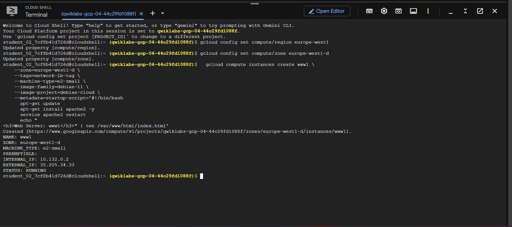
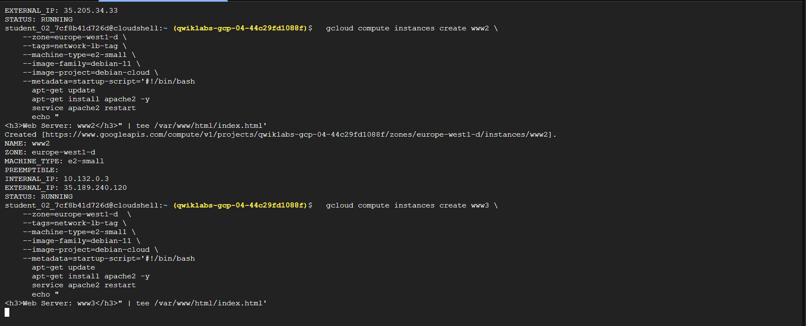
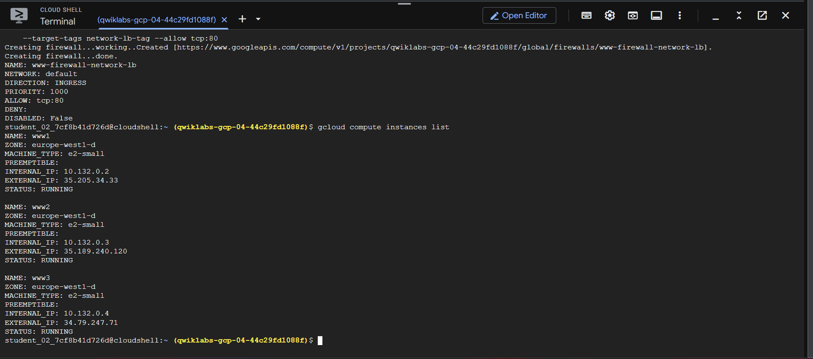
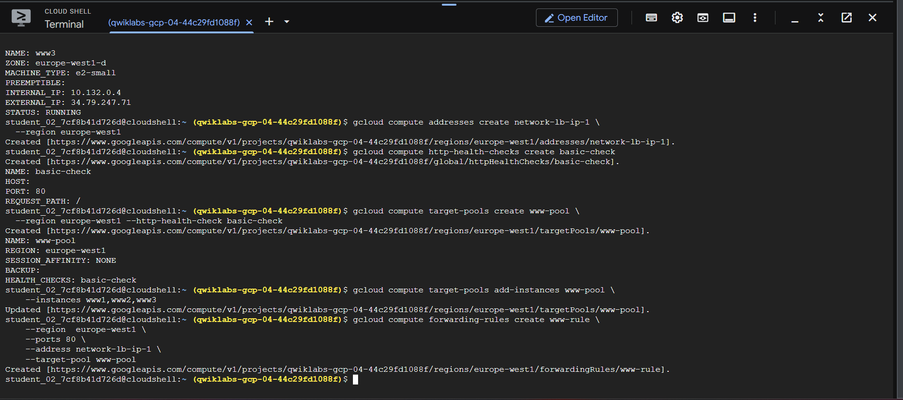

# Layer 4 Network Load Balancer

This lab provisions three Compute Engine web servers and configures an external passthrough Network Load Balancer, a Layer 4 service that forwards traffic based on IP addresses and ports.

## Run

Run these commands from this lab directory. The scripts are in the directory root, not in `scripts/`:

```bash
chmod +x create-vms.sh firewall.sh load-balancer.sh
./create-vms.sh
./firewall.sh
./load-balancer.sh
```

The load balancer health check must be allowed by a narrowly scoped firewall rule. Confirm the exact source ranges and target tags in `firewall.sh` before applying them.






## Cleanup

Delete the forwarding rule, target pool, health check, firewall rules, and VM instances created by the scripts. External IPs and running VMs can incur charges.

**Author:** Kartikeya Uniyal
