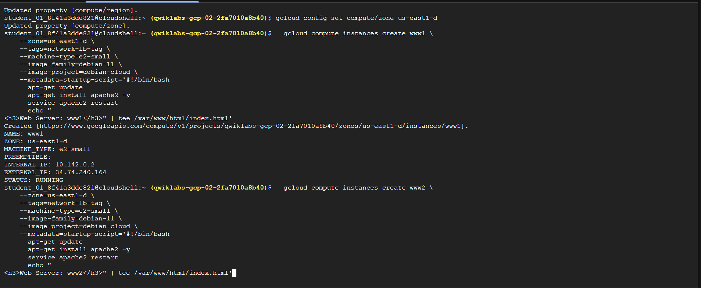
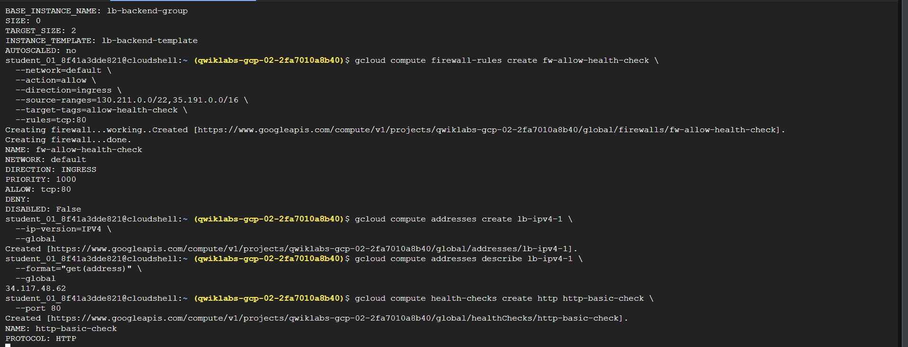
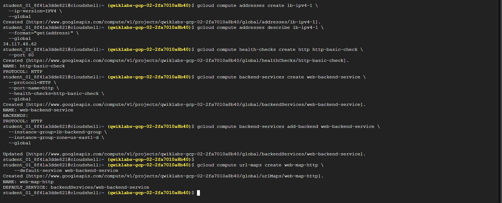
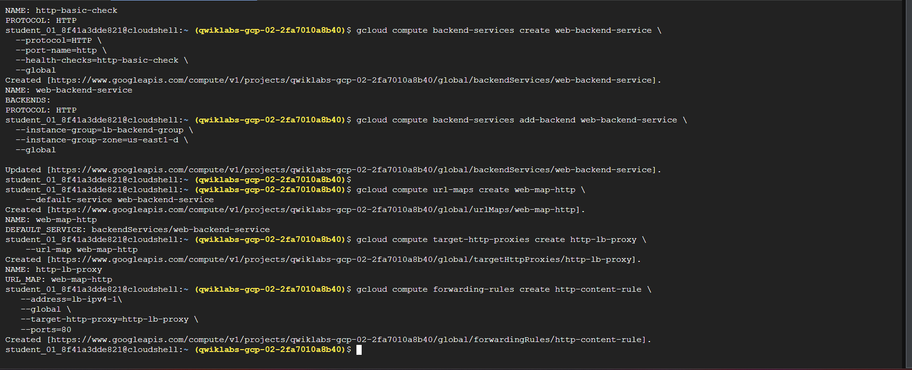
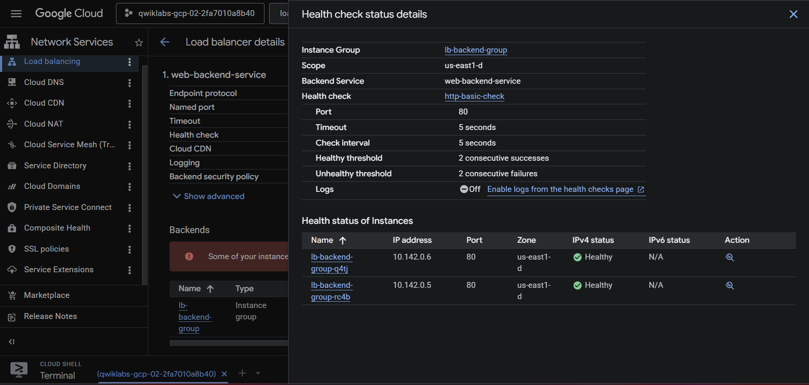

# Layer 7 HTTP Load Balancer

This lab configures a Google Cloud global external Application Load Balancer using a Compute Engine instance template, a managed instance group (MIG), a health check, backend service, URL map, target HTTP proxy, and forwarding rule.

## Run

Run from this lab directory. The scripts are in the directory root:

```bash
chmod +x vm-setup.sh instance-group.sh firewall.sh load-balancer.sh
./vm-setup.sh
./instance-group.sh
./firewall.sh
./load-balancer.sh
```

The documented architecture is highly available only to the extent that the MIG spans multiple zones or is regional. A single-zone MIG remains exposed to a zone outage. Confirm health-check source ranges and backend firewall rules before allowing traffic.







## Cleanup

Delete the forwarding rule, proxy, URL map, backend service, health check, MIG, instance template, firewall rules, and reserved IP created by the scripts.

**Author:** Kartikeya Uniyal
